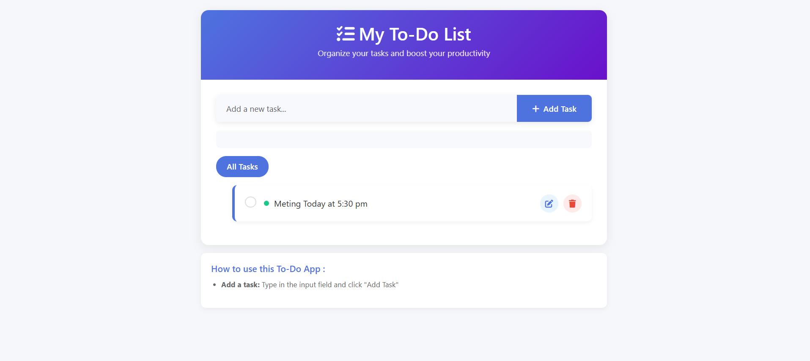

# Simple-To-Do-List
toDoList-php

<h1>⚙️ How to Run the Project</h1>

Follow these steps to run the project locally:

1️⃣ Clone the repository
git clone https://github.com/memo4code2/Simple-To-Do-List.git

2️⃣ Move project to server folder

If you use XAMPP:

C:\xampp\htdocs\

If you use Laragon:

C:\laragon\www\

3️⃣ Create Database

Open phpMyAdmin

Create a database (todo):

Import the SQL file (if exists)
or create a table like this:

CREATE TABLE tasks (
  id INT AUTO_INCREMENT PRIMARY KEY,
  task VARCHAR(255) NOT NULL
);

4️⃣ Configure Database Connection

Open your database config file (example: config.php) and update:

$host = "localhost";
$user = "root";
$password = "";
$database = "todo_app";

5️⃣ Run the project

Open your browser and go to:

http://localhost/Simple-To-Do-List

📂 Project Structure
Simple-To-Do-List/
│
├── index.php
├── add.php
├── delete.php
├── config.php
├── style.css
└── README.md

🎯 Future Improvements

✏️ Edit tasks

🔐 User authentication (Login / Register)

✅ Mark tasks as completed

🛡️ Input validation & security improvements

👨‍💻 Author

Memo (memo4code)

GitHub: https://github.com/memo4code2

LinkedIn: (https://www.linkedin.com/in/mohamed-abolhassan-b16a803a0/)

⭐ Support

If you like this project, don't forget to star ⭐ the repository
and feel free to fork it or contribute 😊
